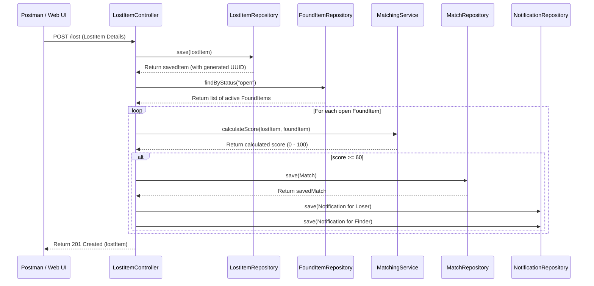

# Developer Guide: Lost & Found College Project

This guide provides an end-to-end overview of the **Campus Lost & Found Portal** project. It is designed to help you understand the file structure, the Spring Boot framework, how data is stored in SQLite, the API workflows, and how to build, run, and test the project manually.

---

## 1. Project File Structure

Here is a map of the important directories and files in this workspace:

```text
lost-found-college/
├── pom.xml                               # Maven project configuration (dependencies, plugins, Java version)
├── lostfound.db                          # SQLite database file (generated automatically at runtime)
├── apache-maven-3.9.6/                   # Pre-packaged local Maven installation
├── src/
│   ├── main/
│   │   ├── java/com/lostfound/           # Java source code
│   │   │   ├── LostFoundApplication.java # The main entry point class of the Spring Boot application
│   │   │   ├── controller/               # API Controllers (expose HTTP endpoints/routes)
│   │   │   │   ├── ClaimController.java
│   │   │   │   ├── FoundItemController.java
│   │   │   │   ├── LostItemController.java
│   │   │   │   ├── MatchController.java
│   │   │   │   ├── NotificationController.java
│   │   │   │   └── UserController.java
│   │   │   ├── model/                    # Data Entities (define the schema/objects mapped to tables)
│   │   │   │   ├── User.java
│   │   │   │   ├── LostItem.java
│   │   │   │   ├── FoundItem.java
│   │   │   │   ├── Match.java
│   │   │   │   └── Notification.java
│   │   │   ├── repository/               # Data Access Layers (Spring Data JPA interfaces for database CRUD)
│   │   │   │   ├── UserRepository.java
│   │   │   │   ├── LostItemRepository.java
│   │   │   │   ├── FoundItemRepository.java
│   │   │   │   ├── MatchRepository.java
│   │   │   │   └── NotificationRepository.java
│   │   │   └── service/                  # Business Logic layer
│   │   │       └── MatchingService.java  # Custom rule engine to calculate match scores
│   │   └── resources/
│   │       ├── application.properties    # Application configurations (database settings, server port)
│   │       └── static/
│   │           └── index.html            # The frontend Web UI (HTML, CSS, JavaScript using fetch API)
│   └── test/                             # Unit tests
│       └── java/com/lostfound/service/MatchingServiceTest.java
```

---

## 2. Spring Boot Framework Crash Course

Spring Boot is a Java framework used to build microservices and REST APIs quickly. Here is how it operates in this project:

### Dependency Injection & Component Scanning
Spring Boot automatically creates instances of classes annotated with `@Component`, `@Service`, `@Repository`, or `@RestController`, and injects them wherever they are needed using `@Autowired`. You do not need to call `new` to instantiate controllers, repositories, or services manually.

### Layered Architecture Workflow
The project follows a standard **Controller-Service-Repository** pattern:

1. **Controller Layer (`@RestController`)**: 
   Exposes HTTP endpoints. It intercepts incoming client requests (e.g., `POST /lost`, `GET /users`), parses request parameters or JSON bodies (`@RequestBody`), calls the service or repository layer, and returns JSON responses.
2. **Service Layer (`@Service`)**:
   Contains business rules and complex operations. For instance, `MatchingService` implements the scoring logic to determine if a lost item matches a found item.
3. **Repository Layer (`@Repository`)**:
   Provides database access. By extending `JpaRepository<EntityName, IdType>`, Spring Data JPA automatically provides standard database methods (`save()`, `findAll()`, `findById()`, `deleteById()`) without you writing any SQL.
4. **Model Layer (`@Entity`)**:
   Defines the database tables. Fields are mapped to database columns automatically using Jakarta Persistence annotations (`@Id`, `@GeneratedValue`, `@ManyToOne`, `@JoinColumn`).

---

## 3. How SQLite Stores Data

### What is SQLite?
SQLite is a serverless, self-contained SQL database engine. Unlike PostgreSQL or MySQL, it does not run as a separate service or background process. Instead, it stores all database tables, indexes, and records in **a single file on your disk**: [lostfound.db](file:///d:/padaipu/lost-found-college-/lostfound.db).

### Configuration in `application.properties`
The database connection is defined in [application.properties](file:///d:/padaipu/lost-found-college-/src/main/resources/application.properties):
- `spring.datasource.url=jdbc:sqlite:lostfound.db`: Instructs Spring Boot to read and write to the local file `lostfound.db`.
- `spring.jpa.hibernate.ddl-auto=update`: Tells Hibernate (the ORM framework) to inspect the Entity models (like `User.java`, `LostItem.java`) and automatically generate or update the tables in the SQLite database to match.
- `spring.jpa.database-platform=org.hibernate.community.dialect.SQLiteDialect`: Tells Hibernate how to construct correct SQLite-specific SQL queries.

---

## 4. API & Match Scan Workflow

Here is how the API handles data and executes the match matching scan:



### Automatic Matching Logic (`MatchingService.java`)
Whenever a new **LostItem** is created, the system scans all open **FoundItems** (and vice versa). It calculates a score out of 100:
- **Category Match**: +40 points if categories match (case-insensitive).
- **Color Match**: +20 points if colors match or are synonyms (e.g., "red" matches "crimson").
- **Location Match**: +20 points if locations overlap (e.g., "Main Library" matches "Library").
- **Date Proximity**: +20 points if the dates are within 14 days of each other.

If the score is **60 or above**, a Match is recorded in the `matches` table as `pending`, and two `Notification` records are created: one for the owner of the lost item and one for the owner of the found item.

---

## 5. How to Run the Project Manually

You can build and run this project using the pre-installed Maven binary included in the workspace directory.

### Step 1: Open Terminal
Open a command prompt or PowerShell window in the root directory: `d:\padaipu\lost-found-college-`.

### Step 2: Compile the Code and Install Dependencies
Run the clean and compile command. This fetches libraries listed in `pom.xml` and checks for Java compilation errors:
```cmd
.\apache-maven-3.9.6\bin\mvn.cmd clean compile
```

### Step 3: Run the Application
Run the Spring Boot application using:
```cmd
.\apache-maven-3.9.6\bin\mvn.cmd spring-boot:run
```
Once you see the log:
`Tomcat started on port 8080 (http) with context path ''`
The application is running and accessible at `http://localhost:8080`.

### Step 4: Open the Frontend UI
Open your web browser and navigate to:
[http://localhost:8080](http://localhost:8080)

This serves the static file [index.html](file:///d:/padaipu/lost-found-college-/src/main/resources/static/index.html) which contains a dashboard to create users, report lost or found items, view matches, and confirm them!

### Step 5: Stop the Server
To stop the server, press `Ctrl + C` in your command line window.

---

## 6. How to Test the APIs (Manual Verification)

You can use API client tools (like Postman) or a PowerShell shell to make requests. Here is how to test it manually using PowerShell:

### 1. Register Users
```powershell
$alice = Invoke-RestMethod -Uri "http://localhost:8080/users" -Method Post -ContentType "application/json" -Body '{"name":"Alice","email":"alice@college.edu","phone":"123"}'
$bob = Invoke-RestMethod -Uri "http://localhost:8080/users" -Method Post -ContentType "application/json" -Body '{"name":"Bob","email":"bob@college.edu","phone":"456"}'
```

### 2. Report Lost Item
```powershell
$lost = Invoke-RestMethod -Uri "http://localhost:8080/lost" -Method Post -ContentType "application/json" -Body "{`"user`":{`"id`":`"$($alice.id)`"},`"category`":`"Wallet`",`"color`":`"Black`",`"location`":`"Library`",`"dateLost`":`"2026-07-25`"}"
```

### 3. Report Found Item (Triggers Matching Engine)
```powershell
$found = Invoke-RestMethod -Uri "http://localhost:8080/found" -Method Post -ContentType "application/json" -Body "{`"user`":{`"id`":`"$($bob.id)`"},`"category`":`"Wallet`",`"color`":`"Black`",`"location`":`"Library`",`"dateFound`":`"2026-07-25`"}"
```

### 4. Query Matches & Notifications
- Fetch Matches:
  ```powershell
  Invoke-RestMethod -Uri "http://localhost:8080/matches" -Method Get
  ```
- Fetch Notifications for Alice:
  ```powershell
  Invoke-RestMethod -Uri "http://localhost:8080/notifications?userId=$($alice.id)" -Method Get
  ```

### 5. Mark Notification as Read
```powershell
# Replace <notification_id> with the actual notification UUID from above
Invoke-RestMethod -Uri "http://localhost:8080/notifications/<notification_id>" -Method Put
```

### 6. Claim the Item (Closes it out)
```powershell
Invoke-RestMethod -Uri "http://localhost:8080/claim/$($lost.id)" -Method Put
```
